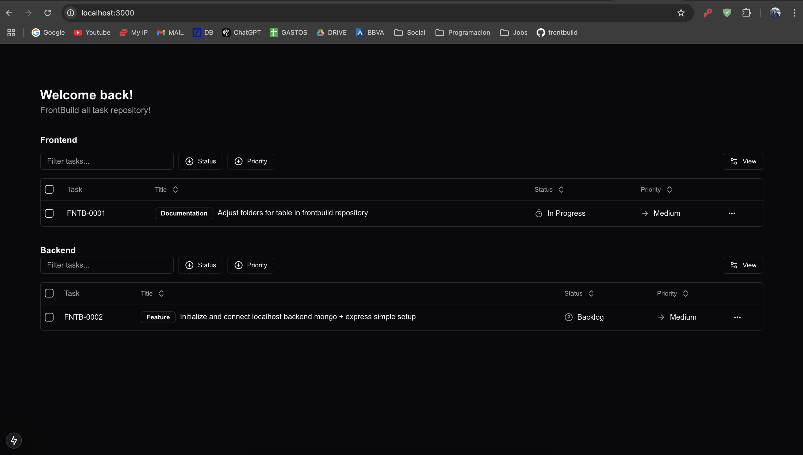

# Frontbuild

[https://frontbuild.vercel.app](https://frontbuild.vercel.app/en)

## Description

Frontbuild is a project that brings together different types of subprojects, each covering distinct functionalities and addressing key aspects of building robust software, such as the testing pyramid (unit, UI, and end-to-end testing), CI/CD pipelines, and mock-based testing.

All of these projects were created with the goal of providing a comprehensive view of the different kinds of features and architectures that can be implemented using Next.js.

Currently, all projects run using Mock Service Worker (MSW), with the backend disabled by default. However, the setup is designed to be flexible and scalable: through feature flags, it is also possible to test real API calls hosted externally when needed.

## Technologies Used

- **Docker**: 
  - Allows you to create, deploy, and run applications in containers, 
  facilitating portability and consistency in the development environment.

- **React 19**: 
  - A JavaScript library for building user interfaces, allowing you to create 
  reusable components and manage the application state efficiently.

- **Redux Toolkit / RTK Query (client side api calls) **: 
  - A tool for managing the application state using Redux, simplifying state management 
  and improving efficiency. It is used alongside React Query for making backend calls 
  and handling data caching. 
  
- **React Testing Library**: 
  - A tool for testing React components, focusing on user interaction and ensuring 
  that the UI works as expected.

- **MSW (Mock Service Worker)**: 
  - A tool for intercepting network requests in the browser and simulating responses, 
  making development and testing easier without relying on a real backend.

- **Shadcn UI**: 
  - A set of user interface components that provides predefined styles and functionalities, 
  allowing for faster and more consistent UI development.

  

