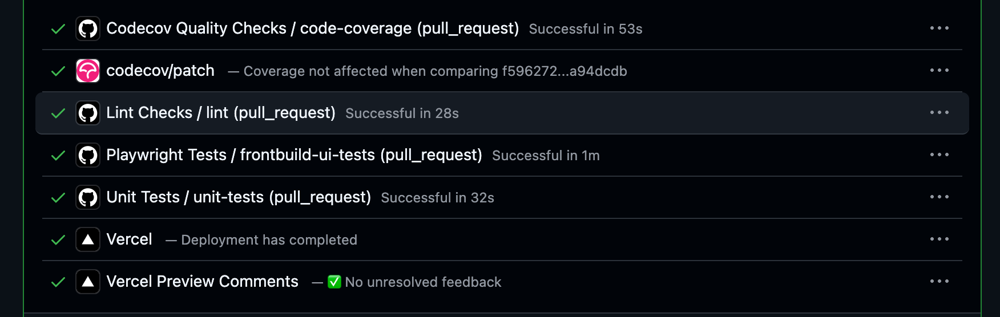

# Frontbuild

[https://frontbuild.vercel.app](https://frontbuild.vercel.app/en)

# How to install?

Locally you can run `npm install --legacy-peer-deps`

## Description

Frontbuild is a project that brings together different types of subprojects, each covering distinct functionalities and addressing key aspects of building robust software, such as the testing pyramid (unit, UI, and end-to-end testing), CI/CD pipelines, and mock-based testing.

All of these projects were created with the goal of providing a comprehensive view of the different kinds of features and architectures that can be implemented using Next.js.

Currently, all projects run using Mock Service Worker (MSW), with the backend disabled by default. However, the setup is designed to be flexible and scalable: through feature flags, it is also possible to test real API calls hosted externally when needed.

## Technologies Used

- **Docker**: 
  - Docker to allow the app to run any container

- **React 19**: 
  - A JavaScript library for building user interfaces, allowing you to create 
  reusable components and manage the application state efficiently.

- **Redux Toolkit / RTK Query (client side api calls)**: 
  - A tool for managing the application state using Redux, simplifying state management 
  and improving efficiency. It is used alongside React Query for making backend calls 
  and handling data caching. 
  
- **React Testing Library**: 
  - A tool for testing React components, focusing on user interaction and ensuring 
  that the UI works as expected.

- **MSW (Mock Service Worker)**: 
  - A tool for intercepting network requests in the browser and simulating responses, 
  making development and testing easier without relying on a real backend.

- **Shadcn UI**: 
  - A set of user interface components that provides predefined styles and functionalities, 
  allowing for faster and more consistent UI development.

- **Framer / Motion**
  - For improving UI transitions

## List of projects
 - **Easy Task Generator**: simple CRUD for create / edit / delete tasks using redux toolkit and rtk query (can work offline with mocks for real testing scenarios and online with real api calls) 

 - **Job Linter**: This project enables local scraping to extract all relevant information from a LinkedIn job posting and process it through an AI-powered endpoint. The goal is to determine whether the job position matches a specific candidate profile or CV.
  
 - **Hearthstone Card Search**: While searching for Hearthstone cards online is generally simple, existing tools often provide a lot of unnecessary information. This project focuses on returning only the essential card data, with the option to view related tokens. All card information is served from a custom API built with NestJS
  
 - **Hearthstone Mulligan Generator**: Mulligan Game Generator: This project allows you to extract all relevant data from a Hearthstone replay game URL to analyze the win rate percentage of cards you kept in your opening hand versus those you mulliganed away. As they say… it’s all about luck, right?
 - **Music Blog**: Using Payload CMS to bring a catalog of the music i like (ongoing...)

## Application Performance 
  

## CI / CD
  - ESLint: A static code analysis tool that scans the source code to detect programming errors, bugs, stylistic issues, and suspicious patterns without executing the code.
  - Component & Integration Testing: Uses React Testing Library, Jest, and MSW to enable integration and behavior testing between components.
  - Code Coverage: Ensures consistently high code quality by maintaining a minimum coverage threshold of 85%.
  - End-to-End (E2E) Testing with Playwright: Full E2E tests to validate screen transitions and application behavior from start to finish.

   
