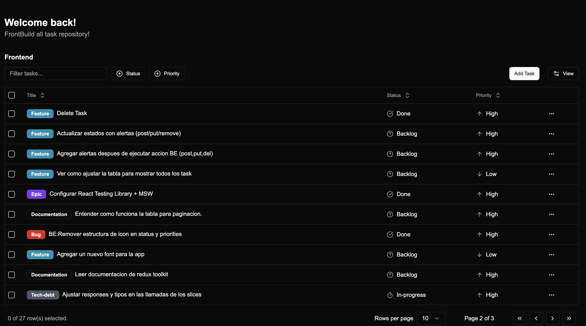

# Frontbuild

[https://frontbuild.vercel.app](https://frontbuild.vercel.app/en)

## Description

The idea of this project is to have a robust base/structure for a front-end (FE) 
and back-end (BE) application using best practices. Building such an application 
today requires a variety of FE skills and a bit of backend knowledge, but if done 
well, it can become a 100% robust application.

The project currently generates, with the command `docker-compose up`, a front-end 
at `localhost:3000` and a back-end at `localhost:8080`, interacting with each other.

The functionality of frontbuild consists of a task table. These tasks will also have 
details in the future, and will not only serve to add tasks but also to add events 
related to my interview processes and provide detailed information about how those 
processes went, etc.

Currently, we can: retrieve tasks from the BE when entering the index of the 
application, add tasks, modify tasks, and delete tasks with different types of 
priorities, labels (epic, tech-debt), and priorities (low, mid, high) using a 
tanstack table.

**NOTE**: I believe that the topics module could encompass server-side rendering 
to explore all its uses.

## Technologies Used

- **Docker**: 
  - Allows you to create, deploy, and run applications in containers, 
  facilitating portability and consistency in the development environment.

- **MongoDB and mongoose**: 
  - A non-relational database that stores data in JSON format, 
  ideal for applications that require flexibility and scalability.

- **Express**: 
  - A minimalist framework for Node.js that simplifies the creation of web applications 
  and APIs, providing a robust structure and middleware to handle HTTP requests.

- **Node.js**: 
  - A JavaScript runtime environment on the server that allows you to build 
  scalable and high-performance applications using a non-blocking I/O model.

- **React**: 
  - A JavaScript library for building user interfaces, allowing you to create 
  reusable components and manage the application state efficiently.

- **Redux Toolkit**: 
  - A tool for managing the application state using Redux, simplifying state management 
  and improving efficiency. It is used alongside React Query for making backend calls 
  and handling data caching. 
  
- **React Testing Library**: 
  - A tool for testing React components, focusing on user interaction and ensuring 
  that the UI works as expected.

- **MSW (Mock Service Worker)**: 
  - A tool for intercepting network requests in the browser and simulating responses, 
  making development and testing easier without relying on a real backend.

- **Shadcn UI**: 
  - A set of user interface components that provides predefined styles and functionalities, 
  allowing for faster and more consistent UI development.

  

